<div align="center">

# 🤖 Telegram Manager

**The most complete open-source Telegram group management toolkit.**

Scrape members, add them to your groups with smart multi-account rotation, run automated campaigns with anti-ban protection, and manage everything from a beautiful web dashboard.

[](https://python.org)
[](LICENSE)
[](https://core.telegram.org/mtproto)
[](https://fastapi.tiangolo.com)

</div>

---

## Dashboard

<div align="center">

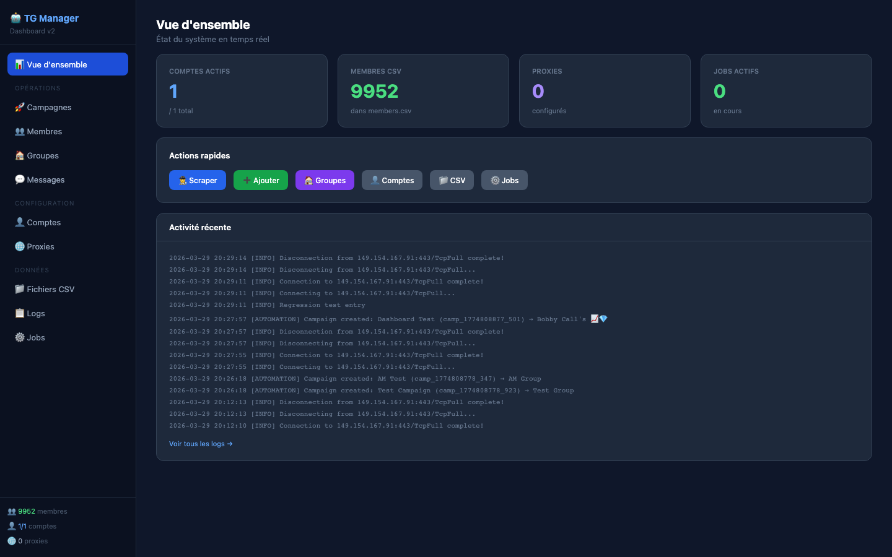

<p><em>Real-time overview — accounts, members, proxies, active jobs</em></p>

<details>
<summary><strong>📸 See all dashboard pages (click to expand)</strong></summary>
<br>

| Campaigns | Campaign Templates |
|:-:|:-:|
| 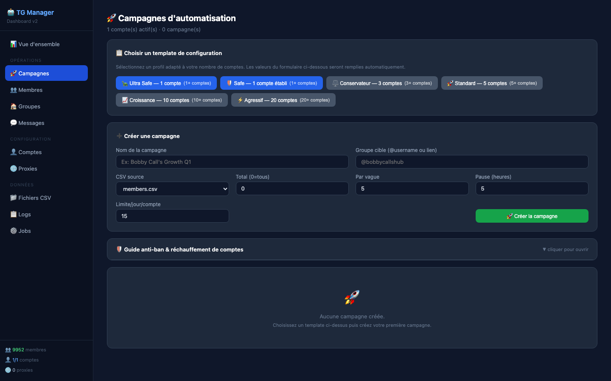 |  |
| *Create, launch, pause & monitor automated campaigns* | *6 pre-built anti-ban presets — auto-fills the form* |

| Members | Groups |
|:-:|:-:|
| 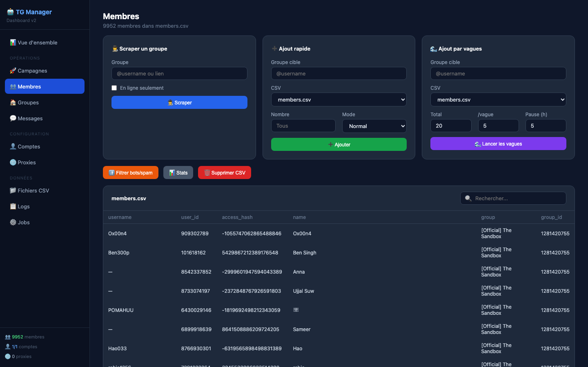 | 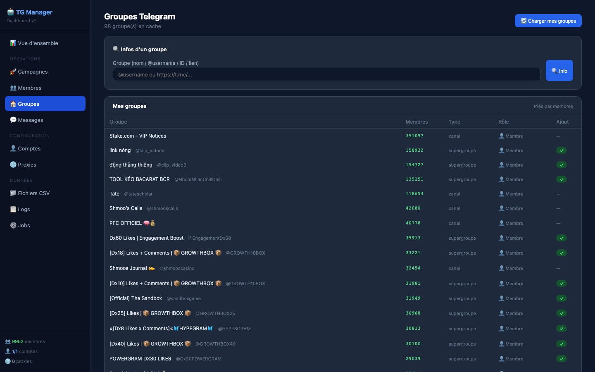 |
| *Scrape, add, wave-add, filter, search* | *Browse all your Telegram groups with roles & member counts* |

| Accounts | Proxies |
|:-:|:-:|
| 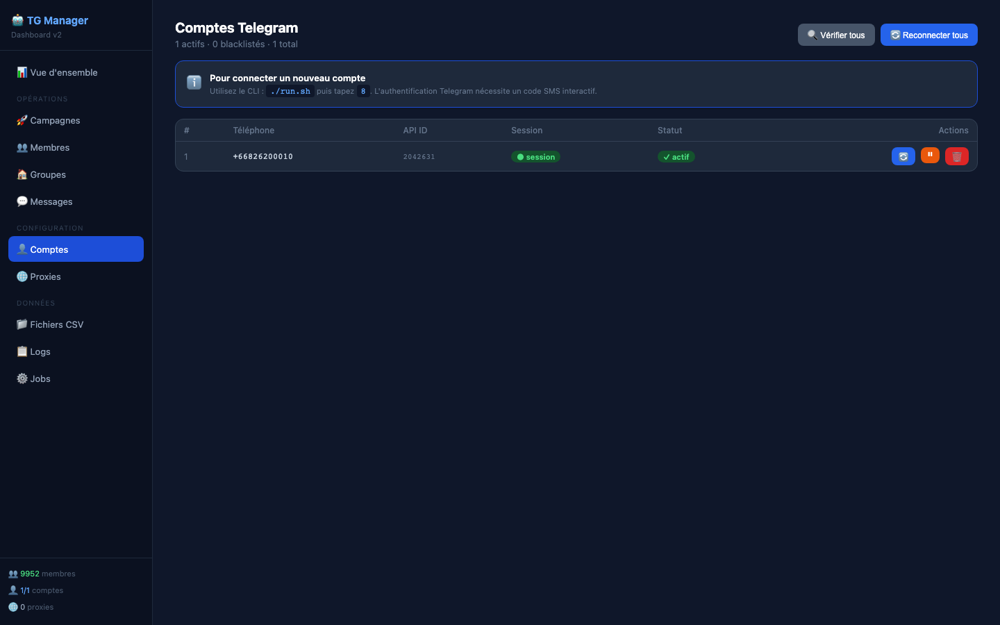 | 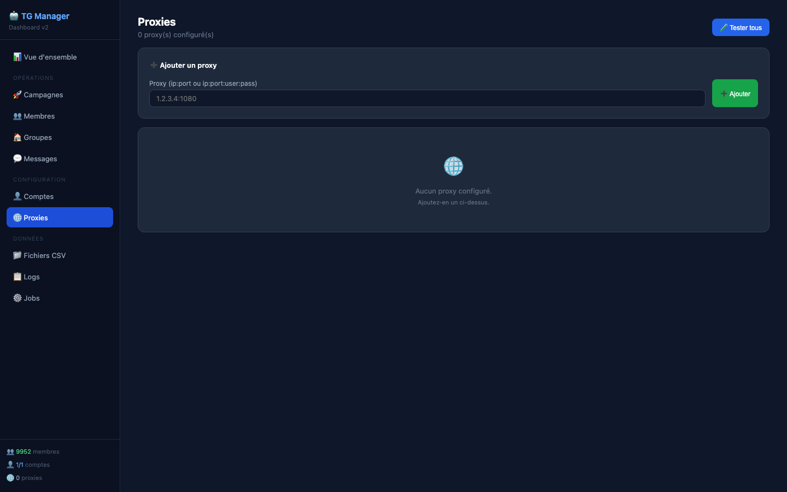 |
| *Manage accounts — blacklist, reconnect, check* | *Add, test & manage SOCKS5 proxies* |

| CSV Files | CSV Preview |
|:-:|:-:|
| 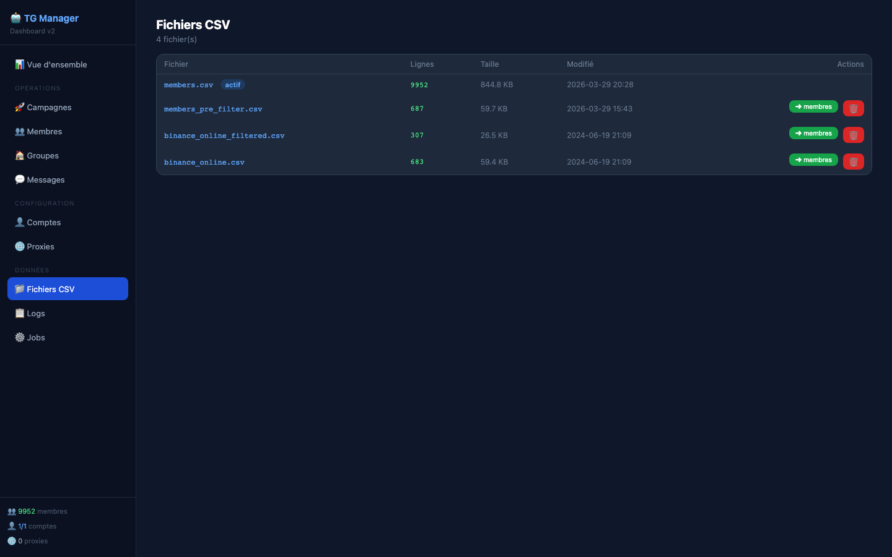 | 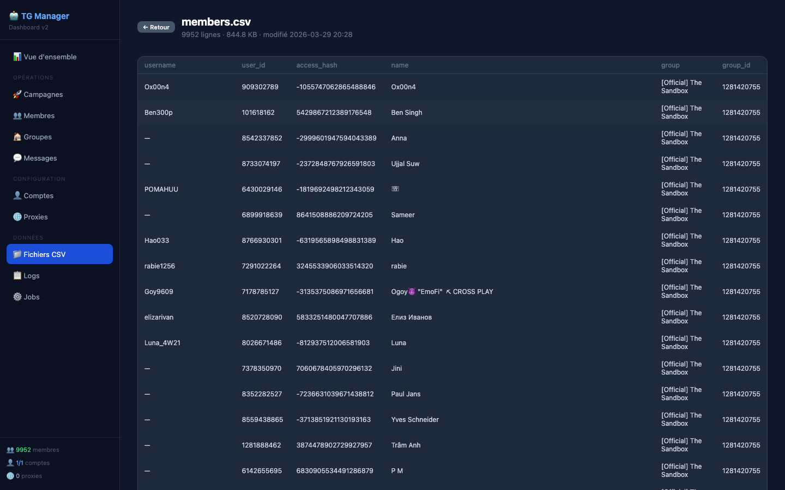 |
| *List all CSVs with size, rows & actions* | *Click any file to preview its content* |

| Messages | Logs |
|:-:|:-:|
| 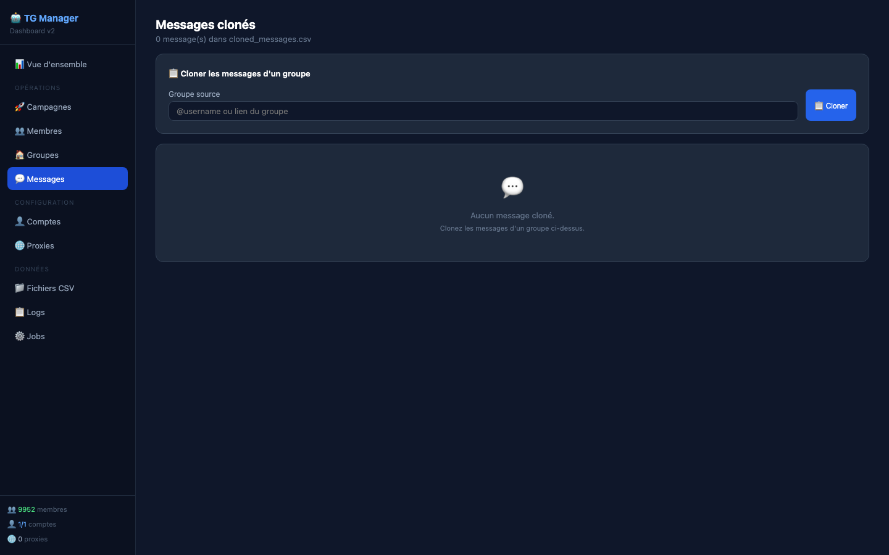 | 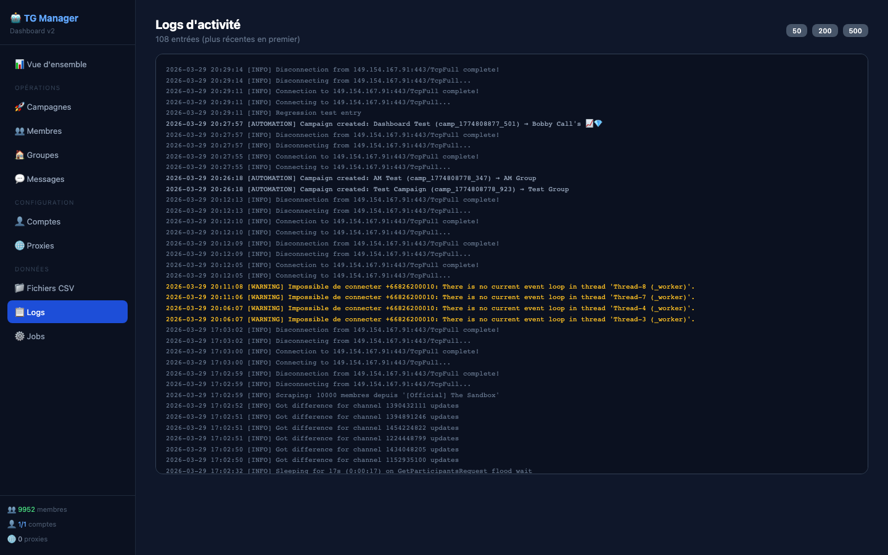 |
| *Clone, search & manage messages* | *Color-coded activity logs* |

| Job Terminal | Job History |
|:-:|:-:|
| 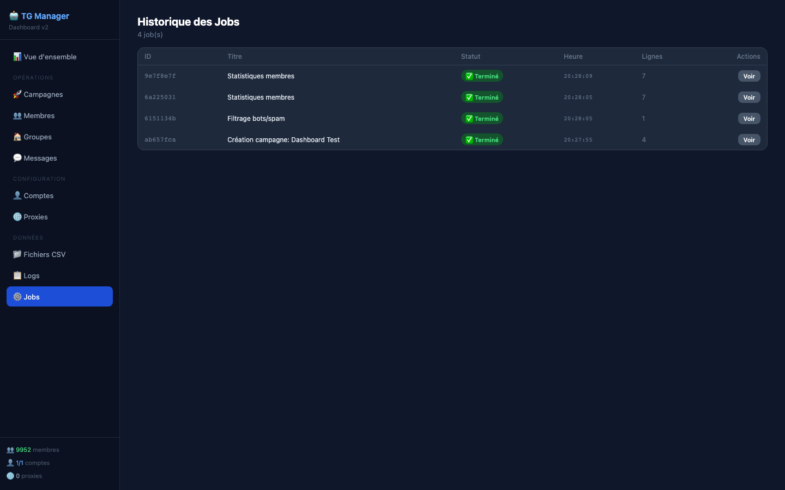 | |
| *Live SSE streaming — watch operations in real-time* | |

</details>

</div>

---

## Features

### 🚀 Campaign Automation Engine
- **Multi-account rotation** — automatically distributes adds across all your accounts
- **Wave-based adding** — configurable waves with hours-long pauses between each
- **Daily limits per account** — never exceeds safe thresholds
- **Auto-resume** — crashes, restarts, Ctrl+C — progress is always saved
- **Silent mode** — "user joined" messages are deleted automatically
- **6 pre-built templates** — from Ultra Safe (3/day) to Aggressive (200/day)
- **Smart flood handling** — PeerFlood → account paused 24h, others take over

### 👥 Member Management
- Scrape members from any group (all, online only, admins, bots)
- Multi-group scraping in one operation
- **Intelligent filtering** — removes bots, spammers, promo accounts, duplicates, ghost accounts
- Search, sort, compare, merge, deduplicate CSV files
- Export to JSON
- Verify member presence in target group

### 🏠 Group Administration
- Group info, restrictions check
- Edit title, description, photo
- List/promote admins
- Ban/unban members
- Generate invite links
- Forward messages between groups

### 💬 Message Operations
- Clone messages from competitor groups
- Send cloned messages to target group
- Mass messaging to member list
- Search within cloned messages
- Download media from groups

### 🌐 Web Dashboard
- **11 pages**, **44 routes**, real-time updates
- Live job terminal with SSE streaming
- Campaign management with progress bars
- Member scrape & add forms
- CSV file browser with preview
- Activity logs with color coding
- **Mobile responsive** — works on phone
- **Toast notifications** — feedback on every action
- **Auto-refresh** — stats update every 30s
- **Zero external CSS dependency** — pure inline styles

### 📊 CLI (63 options)
- Full-featured French CLI (`new.py`) with 63 menu options
- English version (`new_en.py`) with 25 options
- Compact menu by default, `?` for full menu
- Status bar showing accounts/members/proxies
- Pager for long outputs
- Confirmations for destructive operations
- Ctrl+C graceful handling

---

## Quick Start

### 1. Install

```bash
git clone https://github.com/SoClosee/Telegram_ScrappingAdding_toGroup.git
cd Telegram_ScrappingAdding_toGroup
chmod +x install.sh run.sh run_en.sh run_dashboard.sh run_automation.sh
./install.sh
```

### 2. Get Telegram API Keys

1. Go to [https://my.telegram.org/apps](https://my.telegram.org/apps)
2. Log in with your phone number
3. Create an app → copy **API ID** and **API Hash**

### 3. Connect Your Account

```bash
source venv/bin/activate
python connect_account.py
```

Enter your API ID, API Hash, phone number, and the SMS code Telegram sends you.

### 4. Launch

```bash
# Web Dashboard (recommended)
./run_dashboard.sh

# CLI (French, 63 options)
./run.sh

# CLI (English)
./run_en.sh

# Automation Engine
./run_automation.sh
```

---

## Campaign System

The automation engine manages long-running add campaigns with intelligent multi-account rotation.

### How It Works

```
┌─────────────────────────────────────────────────────────┐
│  CAMPAIGN: "Bobby Growth Q1"                            │
│  Target: @bobbycallshub                                 │
│  Source: members.csv (1660 members)                     │
├─────────────────────────────────────────────────────────┤
│                                                         │
│  AccountManager (smart rotation)                        │
│  ┌──────────┐ ┌──────────┐ ┌──────────┐                │
│  │ Account 1│ │ Account 2│ │ Account 3│  ...            │
│  │  5/15 day│ │ 12/15 day│ │ 🚫 flood │                │
│  └──────────┘ └──────────┘ └──────────┘                │
│       ↓             ↓                                   │
│  Wave 1: 5 members (45-75s between each)               │
│  💤 5h pause                                            │
│  Wave 2: 5 members → rotate to next account            │
│  💤 5h pause                                            │
│  Wave 3: ...                                            │
│                                                         │
│  🔇 Join messages auto-deleted                          │
│  💾 Progress saved to SQLite (crash-safe)               │
│  📊 Every add logged with account/status/error          │
└─────────────────────────────────────────────────────────┘
```

### Pre-built Templates

| Template | Accounts | /day | /week | Risk |
|----------|----------|------|-------|------|
| 🐢 Ultra Safe | 1 | ~3 | ~21 | Minimal |
| 🛡️ Safe | 1 (established) | ~10 | ~60 | Low |
| ⚖️ Conservative | 3 | ~30 | ~200 | Moderate |
| 🚀 Standard | 5 | ~50 | ~350 | Moderate |
| 📈 Growth | 10 | ~100 | ~600 | Moderate-High |
| ⚡ Aggressive | 20 | ~200 | ~1200 | High |

### Anti-Ban Safety

- **Daily limits enforced** per account per campaign
- **FloodWait < 5min** → automatic wait + resume
- **FloodWait > 10min** → account paused for the day
- **PeerFloodError** → account blacklisted 24h, others continue
- **Multiple floods** → campaign pauses entirely
- **Daily count reset** at midnight
- **Account warming guide** built into the dashboard

---

## Smart Filtering

Option 5 (CLI) or the "Filter" button (dashboard) intelligently cleans your member CSV:

| Filter | What it removes |
|--------|----------------|
| **Bots** | Usernames ending in "bot" |
| **Spam/Promo** | Keywords: marketing, sms, ambassador, airdrop, bulk, promo... |
| **Ghosts** | No username AND no name |
| **Invalid** | ID ≤ 0, access_hash = 0 |
| **Duplicates** | Same user_id appearing twice |

```
✅ Filtered: 687 → 650 active members (37 removed: 1 bot, 36 spam)
```

---

## Project Structure

```
├── install.sh              # Installation script
├── run.sh                  # Launch CLI (French)
├── run_en.sh               # Launch CLI (English)
├── run_dashboard.sh        # Launch web dashboard
├── run_automation.sh       # Launch automation engine
├── connect_account.py      # Connect a Telegram account
│
├── new.py                  # Main CLI (FR, 63 options)
├── new_en.py               # CLI (EN, 25 options)
├── automation.py           # Campaign automation engine
├── test_all.py             # Test suite
│
├── campaign_templates.json # Pre-built campaign configs
├── config.example.json     # Config file template
├── requirements.txt        # Python dependencies
│
├── dashboard/
│   ├── app.py              # FastAPI backend (44 routes)
│   ├── static/
│   └── templates/          # 12 Jinja2 templates
│       ├── layout.html     # Base template (sidebar + toasts)
│       ├── index.html      # Overview
│       ├── campaigns.html  # Campaign manager
│       ├── campaign_log.html
│       ├── members.html    # Scrape + add + wave forms
│       ├── groups.html     # Group explorer
│       ├── accounts.html   # Account manager
│       ├── proxies.html    # Proxy manager
│       ├── messages.html   # Cloned messages
│       ├── csv.html        # CSV file list
│       ├── csv_preview.html
│       ├── jobs.html       # Job history
│       ├── job.html        # Live job terminal (SSE)
│       └── logs.html       # Activity logs
│
└── docs/screenshots/       # Dashboard screenshots
```

---

## Configuration

Copy the example config:

```bash
cp config.example.json config.json
```

The `config.json` holds your accounts and proxies. **Never commit this file** — it's in `.gitignore`.

### Multi-Account Setup

For serious usage, connect 5-10 accounts. The system rotates between them automatically.

```bash
# Connect each account
python connect_account.py   # Account 1
python connect_account.py   # Account 2
python connect_account.py   # Account 3
# ...
```

### Account Warming (important!)

New accounts need warming before mass-adding:

| Day | Action |
|-----|--------|
| 1-2 | Join 5-10 public groups, read messages |
| 2-3 | Send messages in 2-3 groups |
| 3-4 | Add 1-2 known contacts manually |
| 5-7 | Start with Ultra Safe template (3/day) |
| After 2 weeks | Switch to Safe (10/day) |
| After 1 month | Switch to Standard (15/day) |

### Proxy Setup (optional)

Add SOCKS5 proxies for IP rotation:

```
Format: ip:port or ip:port:username:password
```

Rules:
- 1 proxy per 3-5 accounts
- Residential proxies only (no datacenter)
- Same country as the phone number

---

## Troubleshooting

| Problem | Solution |
|---------|----------|
| `No current event loop` | Already fixed in code — update to latest version |
| `database is locked` | Close other instances, `lsof *.session` to find locks |
| `PeerFloodError` | Wait 24h, account auto-blacklisted |
| `Invalid object ID` | Re-scrape members with your current account |
| Dashboard not loading | `curl http://localhost:8000/` — clear browser cache |
| Session expired | Run `connect_account.py` again |

---

## Tech Stack

| Component | Technology |
|-----------|-----------|
| Telegram API | [Telethon](https://github.com/LonamiWebs/Telethon) (MTProto) |
| Web Dashboard | [FastAPI](https://fastapi.tiangolo.com) + Jinja2 |
| Live Updates | Server-Sent Events (SSE) |
| Interactive UI | [HTMX](https://htmx.org) |
| Database | SQLite (sessions, history, campaigns) |
| CSS | Pure inline (no framework, no CDN) |

---

## License

MIT License — see [LICENSE](LICENSE)

---

<div align="center">

**Built with 🐍 Python and ❤️ for the Telegram community**

</div>
